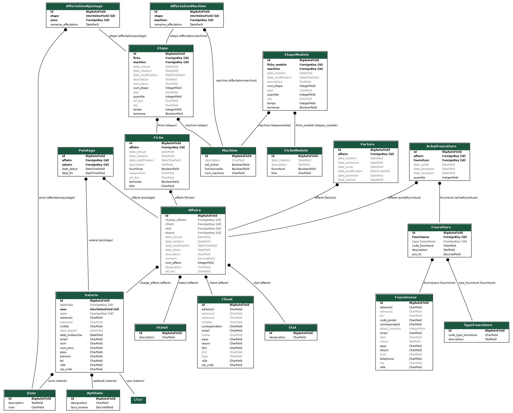

# SGM API

Api pour gestion planning affaire SGM.

## Dépendances
```python
pip install -r requirements.txt
```
## Migrations
```python
python manage.py makemigrations
python manage.py migrate
```

## Lancement
Dans fichier .env, renseigner les variables d'environnement pour dev local:
```
ENV=DEV
```
lancer l'api:
```bash
python manage.py runserver
```

porocess task:
```bash
python manage.py process_tasks
```


## Swagger
Après lancement de l'api, swagger dispo
http://127.0.0.1:8000/api/schema/swagger-ui

## Base de données


